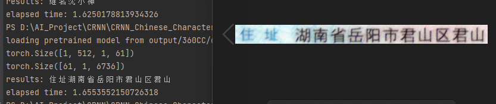
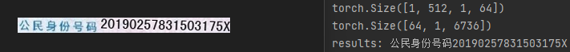

# CRNN_Project
CRNN PROJECT

## TODO
- [x] Completed training on 3.6 million data to achieve 96% accuracy
- [ ] Provide training interface to individual datasets
- [ ] Merging CTPN for complete OCR recognition
- [ ] Provide ID card identification interface
- [ ] Provide business licence identification interface

## Dev Environments
1. WIN 10 or Ubuntu 16.04
2. PyTorch 
3. tensorboardX
4. opencv

## Data
#### Synthetic Chinese String Dataset
1. Download the [dataset](https://pan.baidu.com/s/1ufYbnZAZ1q0AlK7yZ08cvQ)
2. Edit Dataset.data.dataset.py self.root to you image path
3. Download the [labels](https://pan.baidu.com/s/1oOKFDt7t0Wg6ew2uZUN9xg) (password: eaqb)
4. Put *char_std_5990.txt* in **dataset/data/text**
5. And put *train.txt* and *test.txt* in **dataset/data/text**

## Demo

    
    

Note: The ID card numbers appearing in the pictures above are home-made ID card data set numbers (not real resident ID card numbers).

## Reference
- https://github.com/meijieru/crnn.pytorch
- https://github.com/Sierkinhane/CRNN_Chinese_Characters_Rec
- https://github.com/PaddlePaddle/PaddleOCR
